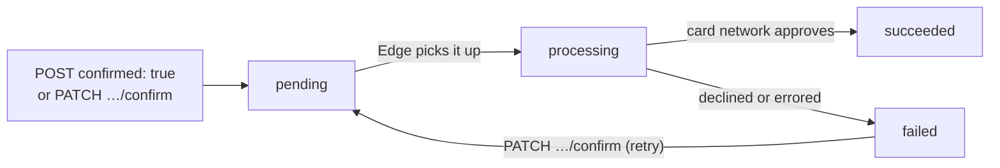

# Payment demands

What `Edge::PaymentDemand` can do, what it deliberately cannot, and the things
that will bite an integrator who reads the API documentation alone.

Everything here describes what the API was observed to do, not what the OpenAPI
document says. Where the two disagree, this file says so.

## One endpoint, two kinds of record

`POST /v2/payment_demands` creates a **payment intent** unless the request
carries `confirmed: true`. The intent comes back looking like a payment demand —
same `type`, same route, same readers — and nothing in the response says which
kind you are holding except `processor_state`:

| Kind | `processor_state` |
| --- | --- |
| Payment **intent** — nothing charged, no authorization held | `incomplete`, `ready`, `confirmed`, `canceled` |
| Payment **demand** — accepted by Edge for processing (not necessarily charged; see [Lifecycle](#lifecycle-what-each-state-actually-means)) | `pending`, `processing`, `succeeded`, `reversed`, `failed`, `disputed` |

There is no `refunded` state. Edge retired it: a refund, partial or full,
leaves the demand `succeeded`, and existing `refunded` records were moved back
to `succeeded`.

The two sets are disjoint, which is the only reason telling them apart is
possible. `#intent?` and `#demand?` are that comparison written down once, and
both answer `false` for a state this client does not know — so a state added
server-side can never be read as "this was charged".

`#demand?` does not mean "this was charged" either. Only `succeeded` says that.

```ruby
demand.intent?        # true  => no money moved
demand.demand?        # true  => Edge accepted it for processing — not "it was charged"
demand.state_known?   # false => neither; go and look
```

## Charging in one step

What a checkout wants. The charge is *queued* during the request and the record
comes back `pending` — which means Edge has stored it, and nothing more. See
[Lifecycle](#lifecycle-what-each-state-actually-means).

```ruby
demand = Edge::PaymentDemand.create(
  {
    amount_cents: 5_00,
    amount_currency: "USD",
    purchase_kind: "order",
    purchase_reference: order.number,
    payer_timezone: "Europe/London",
    idempotency_key: order.edge_idempotency_key,
    confirmed: true,
    # produced by the browser 3DS handshake — see below
    eci: results.eci,
    threeds_status: results.status,
    threeds_version: results.version,
    directory_transaction_eid: results.directory_transaction_id,
    acs_transaction_eid: results.acs_transaction_id
  },
  relationships: {
    payer: customer,
    payment_method: payment_method_id,
    billing_address: address
  }
)

demand.processor_state   # => "pending"
demand.in_flight?        # => true
```

`amount_currency` is required and must be `"USD"`, the only currency the API
supports. (On **refunds** it is inherited from the payment demand and should be
omitted; the client refuses anything but `"USD"`, because an unknown code is a
500 there.)

`update` accepts much less than `create`. `PATCH /v2/payment_demands/{id}`
takes the charge amounts, the descriptive fields (`description`,
`purchase_reference`, `purchase_kind`, shipping, tax, line items,
`email_receipt`) and the relationships, and nothing else — the 3DS results,
`capture_method` and `idempotency_key` are all accepted, answered `200`, and
discarded. The client refuses them rather than letting a caller believe a field
changed. A demand can only be updated at all while it is `failed`.

## Charging in two steps

Create without `confirmed`, then confirm. This is worth knowing about mainly so
its trap is visible: **create validates far less than confirm does.**

```ruby
intent = Edge::PaymentDemand.create(amount_cents: 5_00, amount_currency: "USD", …)
intent.intent?           # => true, processor_state "incomplete"

demand = intent.confirm  # => a new object, same id, processor_state "pending"
```

An intent was accepted here with no billing address and no `purchase_kind`, and
`#confirm` then rejected it for both. Anything missing surfaces at confirm time.
`#confirm` returns a **new** object; the receiver still reports the state it was
parsed with.

`confirm` answers **405** rather than 422 when the record is in a state it
cannot confirm, which is not in the documented status list and does not
distinguish "wrong state" from "wrong method".

## `confirm` is also a retry, and is never retriable

`confirm` also accepts a demand in `failed` — confirming one **charges
again**. That is why the client refuses `retriable: true` on the action's path
at all: `Request#resource_name` stops at a member, so a sub-resource inherits no
resource's replay contract and `Transport` rejects the request before it is
sent.

## Lifecycle: what each state actually means

**`pending` does not mean the charge has gone to the card networks.** It means
Edge has accepted the request: the demand is stored and queued for processing.
Nobody outside Edge has seen the payment yet. `processing` does not mean that
either.



| State | What has actually happened | What has not |
| --- | --- | --- |
| `pending` | Edge has stored the demand and queued it. The API response goes out now. | Nothing has been sent to the payment processor or the card networks. Edge's own risk screening has not run yet. |
| `processing` | Edge has picked the demand up and is about to send it, or has sent it and is waiting for the outcome. | Not necessarily sent: the state is set **before** the payment processor is contacted. |
| `succeeded` | The card network, through the payment processor, **approved** the charge. | Settlement. `succeeded` does not mean funds have settled, and Edge does not report settlement on the demand. |
| `failed` | The charge was declined or errored. | — |
| `reversed`, `disputed` | Documented, but not observed: nothing is known to move a demand into either today. | — |

The outcome is **asynchronous**. Even once the payment processor has answered,
Edge waits for the processor's confirmation before moving the demand to
`succeeded` or `failed`, so a charge can sit in `processing` for some time after
the card was actually approved.

### Sandbox is not a rehearsal of live

Sandbox never contacts a payment processor. The outcome is simulated from the
test card number after a random delay of up to about 25 seconds, and risk
screening is skipped. Timings, and the order in which things happen, are not a
guide to live.

### A demand can stop moving

Edge does not time out or reconcile demands that stop moving. A demand can
stay:

- **`pending`** when Edge's risk screening holds it back — no event fires and
  nothing says why — or when Edge repeatedly fails to pick it up.
- **`processing`** when the connection to the payment processor fails or times
  out, when the processor answers with an error Edge does not act on, or when
  the processor's confirmation never reaches Edge.

So:

- **Treat `pending` and `processing` as "unknown", never as "not charged".** A
  demand stuck in `processing` after a timeout may well have been charged. Do
  not create a second demand to replace it.
- `#in_flight?` is true for both states. Put a deadline on any polling loop,
  and send anything past it to a person to reconcile, not to an automatic retry.
- Fulfil on `succeeded`, via the `transaction.payment_demands.succeeded`
  webhook or a read. Neither `201 Created` nor `pending` is a reason to ship.

### Events

| Event | Fires when |
| --- | --- |
| `transaction.payment_demands.created` | The demand is created, by the API, by confirming an intent, or by a subscription billing cycle |
| `transaction.payment_demands.updated` | `PATCH` update, or `PATCH …/confirm` |
| `transaction.payment_demands.succeeded` | After the move to `succeeded` |
| `transaction.payment_demands.failed` | After the move to `failed`, for a decline or an error |
| *(none)* | `pending → processing` |

The `succeeded` and `failed` events are sent just after the state changes, so a
read can show the new state a moment before the webhook arrives.

`transaction.payment_demands.refunded` is still listed in the webhook
subscription docs, and nothing emits it. A refund does not change the demand; see
[refund-demands.md](refund-demands.md).

## The idempotency key does not prevent a double charge

The field's own description reads *"a unique value that prevents double
charging"*. Today it does not. Two byte-identical POSTs sharing one key produced
**two payment demands, both `201`**.

So:

- `contract/manifest.yml` records `idempotent_writes: false`, and
  `retriable: true` is refused on `PaymentDemand.create`.
- **Send an idempotency key anyway.** It costs nothing, and it is what an
  eventual replay will find your record by.
- **Do not retry a create on a timeout.** Read the demand back by
  `purchase_reference` — which you control and which is filterable — and decide
  from what you find.

Edge is working on a fix. Once a deployed server replays a matching request, and
that has been verified against sandbox, `payment_demands` is marked idempotent
in `contract/manifest.yml` and `retriable: true` starts working with no other
change.

## Creating a demand usually needs the browser

When 3D Secure is on, six attributes are required — `eci`, `threeds_status`,
`threeds_version`, `threeds_cryptogram`, `directory_transaction_eid`,
`acs_transaction_eid` — and every one is a result of a handshake the browser
performs. A server-side job cannot invent them, so a Solidus or Spree gateway
cannot build the request from order data alone: the 3DS results have to be
captured at checkout and carried through.

**Whether 3DS is on is not a property of the API.** It is a per-merchant,
per-card-kind setting of the merchant's payment processing configuration, and
nothing in any response reports it. With it off, none of the six is required, so
a purely server-side create *is* possible for such a merchant and card kind, and
impossible otherwise.

**3DS-required is the default.** Assume you need the browser unless Edge has
confirmed that 3DS is off for your account and card kind.

`payer_timezone` is required either way.

All seven of these are documented `readonly: true`. They are not: every one is
accepted on create, and `payer_timezone` is required. The client does not treat
the documented flag as authoritative for them.

## What this class does not have, and why

| Missing | Why |
| --- | --- |
| `#capture` | No route exists. `confirm` is not capture. Deferred capture is unsupported today for PCI compliance reasons, and Edge's timeline for it may exceed a year. |
| `#void` | No route exists. A refund is not a void; presenting one as the other would promise a distinction the API cannot express. |
| `#amount_refunded` | `amount_refunded_cents` is in the OpenAPI document and served by nothing. The server caps refunds at the demand's amount but does not serialize a refunded total. List the demand's `succeeded` refunds instead. |
| `#refunded?` | The state is gone. A refunded demand — partially or fully — stays `succeeded`. |
| `capture_method: "manual"` | Accepted by the API, sent to the card network as an authorization only, and then **nothing can capture or void it**. It sits authorised against the cardholder's account until the authorization expires. The client refuses it. |

The last one is the only place this client declines something the server would
accept, and it is because "the server accepted it" is exactly what makes the
outcome invisible. `client.post("v2/payment_demands", body: …)` still sends
whatever you like.

## Reading a demand

```ruby
demand.succeeded?            # terminal states, tolerant of unknown ones
demand.failed?
demand.in_flight?            # pending or processing — worth polling, with a deadline
demand.line_items            # array of hashes, or []
demand.verification_passed?  # AVS and CVC both matched; false when unchecked
```

There is deliberately no `#confirmed?`. `#confirmed` is the boolean attribute
the create request carried, and a predicate one character away meaning the
intent's `processor_state` instead is a bug waiting to be written — compare
`processor_state == "confirmed"` for that. The attribute is unreliable in any
case: a demand created with `confirmed: true` came back with `confirmed` **nil**.

## Refunding a demand

Refunds are their own resource. A demand can be refunded several times, up to
its amount in total; omit `amount_cents` to refund whatever remains.

```ruby
Edge::RefundDemand.create(
  { reason: "customer_canceled", amount_cents: 25_00, idempotency_key: return_key },
  relationships: { payment_demand: demand },
  retriable: true
)

refunds = Edge::RefundDemand.list(filter: { "payment_demand.id" => demand.id })
```

Pending, processing and succeeded refunds all count against the remaining
balance; a failed one releases its amount. The refunded total is the sum of the
`succeeded` ones. The refund lifecycle — including why its `pending` does not
mean money is on its way back — is in [refund-demands.md](refund-demands.md).

## Collections are not paginated

`Edge::PaymentDemand.list` returns **every** matching record in one response.
There is no `page[…]` support and no `links.next`. Filter aggressively —
`purchase_reference`, `created_at_gte` — and see [pagination.md](pagination.md).
