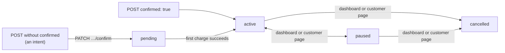

# Payment subscriptions

How recurring billing works in Edge, what a subscription's `status` does and
does not tell you, and where the charges it makes actually show up.

**This client has no `Edge::PaymentSubscription` class yet.** Use the raw client
(below). The resource is in `contract/manifest.yml`, but its create and billing
paths have not yet been exercised against sandbox the way payment demands and
refunds have. Treat this file as the expected behaviour, and verify the parts
you depend on in sandbox — the last section lists the ones most worth checking.

## A subscription does not charge. It makes payment demands.

Every charge is an ordinary payment demand with a `payment_subscription`
relationship. It moves through the same `pending → processing → succeeded /
failed` pipeline as a one-off demand, with the same meaning: **`pending` means
Edge has accepted the charge, not that it has gone to the card networks.** See
[payment-demands.md](payment-demands.md#lifecycle-what-each-state-actually-means).

That also means that **subscription `active` does not mean "paid"**, and a
subscription does not stop being `active` when a charge fails. The payment
demands are the only record of what was charged:

```ruby
charges = Edge::PaymentDemand.list(filter: { "payment_subscription.id" => subscription_id })
charges.select(&:succeeded?)
```

The subscription resource serializes no `payment_demands` relationship, so
that filter is the only way to reach them.

## Routes

| Route | Does |
| --- | --- |
| `POST /v2/payment_subscriptions` | Creates a subscription (`confirmed: true`) or a subscription *intent* (without it) |
| `GET /v2/payment_subscriptions[/{id}]` | List or show. A list returns only real subscriptions. Show also finds an intent. |
| `PATCH /v2/payment_subscriptions/{id}` | Updates an **unconfirmed intent** only. A confirmed subscription answers **405**. |
| `PATCH /v2/payment_subscriptions/{id}/confirm` | Turns an intent into a subscription, or retries the last charge of an `active` subscription if that charge `failed` |

There is **no API to cancel, pause, resume, or change the amount or card** of a
confirmed subscription. Those happen only in the
Edge dashboard or on the customer-facing subscription page, and **none of them
emits a webhook**. A subscription can become `paused` or `cancelled` without
your application being told.

## Creating one

The same shape as a payment demand, plus the billing fields. With the raw
client, the body is a JSON:API document you encode yourself:

```ruby
client = Edge.default_client # or Edge::Client.new(api_key: …)

response = client.post("v2/payment_subscriptions", body: JSON.generate(
  data: {
    type: "payment_subscriptions",
    attributes: {
      amount_cents: 20_00, amount_currency: "USD",
      billing_period: "one_month", billing_scheme: "per_unit",
      slug: "pro-monthly", confirmed: true,
      idempotency_key: SecureRandom.uuid,
      payer_timezone: "Europe/London",
      # the browser's 3DS results, as for a payment demand
      eci: results.eci, threeds_status: results.status, threeds_version: results.version,
      directory_transaction_eid: results.directory_transaction_id,
      acs_transaction_eid: results.acs_transaction_id
    },
    relationships: {
      payer:           { data: { type: "customers", id: customer.id } },
      payment_method:  { data: { type: "payment_methods", id: payment_method_id } },
      billing_address: { data: { type: "consumer_addresses", id: address.id } }
    }
  }
))

subscription = response.data["data"]
```

Required with `confirmed: true`:

- **Relationships:** `payer`, `payment_method`, `billing_address`.
- **Attributes:** `amount_cents` (at least 10), `amount_currency`, `slug`,
  `billing_period`, `billing_scheme` (`per_unit` is the only value),
  `idempotency_key`, `payer_timezone`.
- **3DS:** `threeds_version`, `threeds_status`, `eci`,
  `directory_transaction_eid` and `acs_transaction_eid`. Unlike a payment
  demand, this create path requires them **even when 3DS is switched off** for
  the merchant.

Optional:

- `billing_cycle_anchor_at` defaults to now.
- `proration_behavior` defaults to `none`.

`billing_period` is one of `one_day`, `seven_days`, `fourteen_days`,
`thirty_days`, `one_month`, `six_months` or `twelve_months`. Edge's own API
docs list `weekly` to `yearly` instead. Those are stale: the API rejects them.

Accepted and never read: `trial_end_at` and `canceled_at_period_end`. There is
no trial and no end date. `current_period_start_at` and `current_period_end_at`
are never written. There is no maximum number of charges either: a subscription
bills until someone cancels it in the dashboard.

### The idempotency key

The key is **required**. A create whose key matches an existing subscription
(or subscription intent) returns **`201` with that record**, and does not
compare the rest of the request.

So a retry is safe, and a key reused for a *different* subscription silently
returns the old one. `contract/manifest.yml` still records
`idempotent_writes: false`, because no replay contract is documented and the
intent side has no unique index. Use a fresh random UUID per subscription.

## Lifecycle



| `status` | Means |
| --- | --- |
| `pending` | Created from a confirmed intent, and no charge has succeeded yet |
| `active` | Billing is scheduled. It says nothing about whether the last charge succeeded. |
| `paused` | Paused in the dashboard or on the customer page |
| `cancelled` | Cancelled in the dashboard or on the customer page, immediately, with no proration or refund |

Only a person moves a subscription between `active`, `paused` and
`cancelled`. Failed charges, `trial_end_at` and `canceled_at_period_end` change
nothing. There is no `past_due` status, although Edge's view docs mention one.

The two create paths **do not start in the same state**:

- `confirmed: true` inserts the subscription and moves it straight to `active`
  in the same request.
- Confirming an intent creates it `pending`. It only becomes `active` once its
  first charge succeeds.

## Billing

1. **At creation.** If `next_billing_at` (the anchor) is before the end of
   today, UTC, the first charge is queued immediately. With
   `proration_behavior: "create_prorations"` and an anchor less than one period
   away, a prorated charge is also made immediately
   (`amount × remaining / period`, and at least 10¢).
2. **Up to an hour ahead.** Edge looks for `active` subscriptions whose
   `next_billing_at` falls between three days ago and one hour from now, and
   schedules their charge for exactly `next_billing_at`.
3. **At `next_billing_at`.** Edge creates a `pending` payment demand and emits
   `transaction.payment_demands.created`. From there it is an ordinary demand.
4. **On success.** The anchor moves to the time the charge completed, and
   `next_billing_at` to one period after that. Because it moves from completion
   rather than from the schedule, the billing time drifts later each cycle.

What that means for you:

- **Billing only advances on a successful charge.** A failed charge leaves
  `next_billing_at` where it was, and no later periods are billed until a retry
  succeeds.
- **A pause or cancel within an hour of billing may not stop the charge.** The
  charge is already scheduled by then, and the status is not checked again
  before it is made.
- **A subscription that misses the three-day window is not billed again.** The
  window only looks back three days, so a subscription paused for longer, and
  then resumed without `next_billing_at` moving, falls outside it.
- Receipts are emailed **only for the first successful charge**. Renewals send
  none, whatever `email_receipt` says. `subscription_notification_email` is used
  as the email *sender*, not as an extra recipient.

## When a recurring charge fails

The payment demand goes `failed`. The subscription stays `active`.

Edge retries automatically, once a day, but **only** when all of these hold:

- the subscription has had a successful charge before;
- this is not that first charge;
- the decline is one Edge treats as temporary, such as insufficient funds, as
  opposed to a stolen or closed card.

Each retry re-runs the **same** payment demand and emails the customer a "we
couldn't process your payment" notice. No limit on the number of retries is
documented.

A **first** charge that fails is not retried automatically. For a subscription
created with `confirmed: true` (so `active`), `PATCH …/confirm` retries it. A
subscription created from an intent is still `pending`, so confirm answers
405 and it cannot be retried through the API at all.

## Events

| Event | Fires when |
| --- | --- |
| `transaction.payment_subscriptions.created` | Created with `confirmed: true` |
| `transaction.payment_subscriptions.updated` | An intent is updated or confirmed (a subscription made from an intent never gets `created`), and after the first successful charge |
| `transaction.payment_demands.created` | Each billing cycle's charge is created. A first-cycle prorated charge does **not** emit it. |
| `transaction.payment_demands.succeeded` / `.failed` | Each charge settles one way or the other, as for any payment demand |
| *(none)* | Pause, resume, cancel, or a failed-charge retry being scheduled |

Creating an unconfirmed intent emits nothing. `transaction.payment_subscriptions.deleted`
is documented, and nothing emits it.

A webhook consumer should therefore key renewals off
`transaction.payment_demands.succeeded` for a demand whose
`payment_subscription` is set. Periodically re-read the subscriptions it
cares about, since status changes arrive by no other route.

## Worth verifying in sandbox before relying on renewals

These are the behaviours most likely to surprise, and the ones to exercise
before building on subscriptions:

- **A subscription created with `confirmed: true` may not advance after its
  first charge.** Check that `next_billing_at` moves, and that
  `transaction.payment_demands.succeeded` arrives, once the first charge
  succeeds. The demand itself ends `succeeded` either way.
- **A subscription created from an intent, with a future anchor and no
  proration, may never be billed.** It stays `pending` until a charge succeeds,
  and only `active` subscriptions are picked up for billing.
- **With proration on an intent-created subscription, the chosen anchor may be
  lost.** The first full charge may come one period after the prorated charge,
  not on the requested date.
- **A successful automatic retry may leave its payment demand `pending`**, even
  though the card was charged. A retry made through `PATCH …/confirm` is not
  affected.
