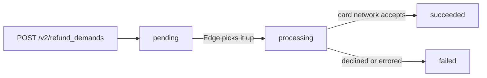

# Refund demands

How a refund moves through Edge, what each `state` means, and when to tell a
customer their money is on its way back.

The rules for creating one — partial refunds, the remaining balance, the
idempotency replay — are documented on `Edge::RefundDemand` and summarised in
[payment-demands.md](payment-demands.md#refunding-a-demand). This file covers
what happens after the `201`.

## `pending` means Edge accepted the refund, not that it was sent

```ruby
refund = Edge::RefundDemand.create(
  { reason: "customer_canceled", amount_cents: 25_00, idempotency_key: return_key },
  relationships: { payment_demand: demand },
  retriable: true
)

refund.state   # => "pending" — stored and queued. The card network has not seen it.
```

When `POST /v2/refund_demands` answers `201`, Edge has, atomically:

1. checked the amount against the payment demand's remaining balance, in a way
   that concurrent refunds cannot both spend;
2. checked the idempotency key;
3. stored the refund as `pending`, which reserves its amount against the demand;
4. queued it for processing;
5. recorded `transaction.refund_demands.created`.

That is all. **Nothing has gone to the payment processor or the card
networks.** Telling a customer "your refund has been issued" at this point is
premature.

## Lifecycle



| State | What has actually happened | What has not |
| --- | --- | --- |
| `pending` | The refund is stored, its amount is reserved against the payment demand, and it is queued. | Nothing sent to the payment processor. |
| `processing` | Edge has picked the refund up and is about to send it, or has sent it and is waiting for the outcome. | Not necessarily sent: the state is set **before** the payment processor is contacted. |
| `succeeded` | The payment processor confirmed the refund was accepted. | That the cardholder has the money. The card network and issuer post a refund to the cardholder's account days later, and Edge does not report that. |
| `failed` | The refund was declined or errored. The reserved amount is released. | — |

As with payments, **the processor's first answer does not complete the
refund.** An approval leaves the refund in `processing` until the processor's
confirmation reaches Edge. A decline or error, on the other hand, fails it
straight away.

Edge always issues a refund, never a void, whether or not the original charge
has settled. A refund issued shortly after the charge, before settlement, may
therefore be rejected and end `failed`. Try again after settlement.

## Which payment demands can be refunded

Only a `succeeded` one. A demand that is `pending`, `processing`, `failed`,
`disputed` or `reversed` is answered with a 422 on `payment_demand`: "must have
been successfully processed to be refunded".

A succeeded demand can still be refused with "has no refundable
authorizations" when there is nothing left on the original charge to refund
against.

Refunding does not change the payment demand. It stays `succeeded`, carries no
refunded total, and emits no event.

## A refund cannot be cancelled or edited

The API offers list, show and create only. There is no cancel state and no
update. A refund that should not have been made cannot be recalled through the
API once created.

## A refund can stop moving

Edge does not time out or reconcile refunds that stop moving. A refund can
stay:

- **`pending`** when Edge repeatedly fails to pick it up.
- **`processing`** when the connection to the payment processor fails or times
  out, when the processor answers unexpectedly, or when its confirmation never
  reaches Edge.

**Both keep their amount reserved**, so a stuck refund also blocks refunding
that much again. Only `failed` releases it.

So:

- Tell the customer the refund is issued on `succeeded`, not on `201`.
- Put a deadline on polling `#in_flight?`, and hand anything past it to a person.
  Do not create a second refund to replace a stuck one: the first may have
  reached the card network. The remaining-balance cap will usually refuse the
  second anyway, because the first is still reserving its amount.

## Events

| Event | Fires when |
| --- | --- |
| `transaction.refund_demands.created` | The refund is created (`pending`) |
| `transaction.refund_demands.updated` | `pending → processing`, **and** `processing → succeeded` |
| `transaction.refund_demands.failed` | → `failed` |

There is no `transaction.refund_demands.succeeded`. And `updated` fires twice
on the way to success, first on entering `processing`. An `updated` delivery
is therefore not a success. Read the refund's state, from `event.data` or a
fresh read, and act on `succeeded?`:

```ruby
case event.code
when "transaction.refund_demands.updated"
  refund = Edge::RefundDemand.retrieve(event.resource_id)
  mark_refunded!(refund) if refund.succeeded?
when "transaction.refund_demands.failed"
  flag_for_review!(event.resource_id)
end
```

## Knowing what has been refunded

List the demand's refunds, and sum by state, never across all of them:

```ruby
refunds  = Edge::RefundDemand.list(filter: { "payment_demand.id" => demand.id })
refunded = refunds.select(&:succeeded?).sum(&:amount_cents)                        # money returned
reserved = refunds.select { _1.succeeded? || _1.in_flight? }.sum(&:amount_cents)   # counts against the cap
```

A `failed` refund is in that list, and refunded nothing.
